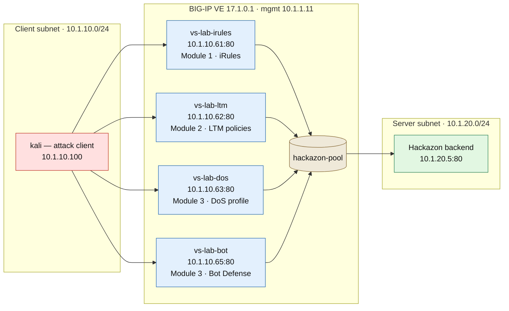

# BIG-IP L7 DoS Lab

A lab environment for testing, demonstrating, and analyzing BIG-IP Layer 7 Denial of Service (L7DoS) protection features.

## Lab Overview

This lab covers three BIG-IP L7DoS mitigation methods across ten scenarios:

- **iRule-based rate limiting** — per-IP, per-URI, concurrent connection, sliding window, and a custom header-absence L7DoS signature
- **LTM Policy path-based rate limiting** — declarative path matching with rate filters, iRule triggers, and datagroup-driven dynamic config
- **ASM / Advanced WAF DoS protection** — TPS thresholds, Behavioral DoS (BADoS), Proactive Bot Defense, stress-based detection, and custom persistent DoS signatures

## Topology

Each protection method runs on its own virtual server, all fronting the same Hackazon backend. See [`docs/setup/lab-topology.rst`](docs/setup/lab-topology.rst) for the build commands.



## Directory Structure

```
BIG-IP-L7DoS-Lab/
├── configs/          # BIG-IP AS3 / TMSH config snippets
│   ├── profiles/     # DoS protection profiles
│   ├── policies/     # Local Traffic Policies
│   └── irules/       # Supporting iRules
├── scripts/          # Lab automation and traffic generation
│   ├── attack/       # Simulated attack scripts (authorized lab use only)
│   └── setup/        # Lab environment provisioning
├── docs/             # Lab guides and architecture notes
└── tests/            # Validation and verification scripts
```

## Prerequisites

- BIG-IP 14.1+ (or BIG-IP Next)
- ASM / Advanced WAF license for DoS profiles
- Lab network access configured per `docs/network-topology.md`

## Quick Start

1. Review `docs/lab-setup.md` for environment prerequisites
2. Deploy base config: `configs/profiles/`
3. Run a baseline traffic test: `scripts/setup/baseline-traffic.sh`
4. Trigger a simulated L7DoS event: `scripts/attack/` (lab environment only)
5. Observe mitigation in BIG-IP Analytics / TMUI

## Lab Scenarios

### Module 1 — iRules
| Scenario | Description | Config |
|----------|-------------|--------|
| 1.1 | Per-IP rate limiting | `configs/irules/rate-limit-per-ip.tcl` |
| 1.2 | Per-URI rate limiting | `configs/irules/rate-limit-per-uri.tcl` |
| 1.3 | Concurrent connection limit | `configs/irules/concurrent-conn-limit.tcl` |
| 1.4 | Sliding window 429 | `configs/irules/sliding-window-429.tcl` |
| 1.5 | Custom L7 DoS signature (header-absence rate limit) | `configs/irules/custom-l7dos-signature.tcl` |

### Module 2 — LTM Policies
| Scenario | Description | Config |
|----------|-------------|--------|
| 2.1 | Path-based rate filter | `configs/policies/rate-filters.sh` |
| 2.2 | Policy + iRule event trigger | `configs/policies/path-rate-policy.json` |
| 2.3 | Policy + datagroup (dynamic) | `configs/policies/datagroup-rate-policy.json` |
| 2.4 | Reject known-bad paths | `configs/policies/reject-policy.json` |

### Module 3 — ASM / Advanced WAF
| Scenario | Description | Config |
|----------|-------------|--------|
| 3.1 | TPS-based DoS profile | `configs/profiles/tps-dos-profile.json` |
| 3.2 | Behavioral DoS (BADoS) | `configs/profiles/bados-profile.json` |
| 3.3 | Proactive Bot Defense | `configs/profiles/bot-defense-profile.json` (DoS profile) + `configs/profiles/bot-defense-standalone.conf` (standalone profile: verify before/after, per-bot rate limits) |
| 3.4 | Stress-based detection | *(see docs/module3-asm-waf.md)* |
| 3.5 | Custom persistent DoS signatures | `configs/profiles/dos-persistent-signature.conf` |

## Important Notice

Attack simulation scripts in `scripts/attack/` are for **authorized lab environments only**. Do not run against production systems or systems you do not own and have explicit permission to test.
