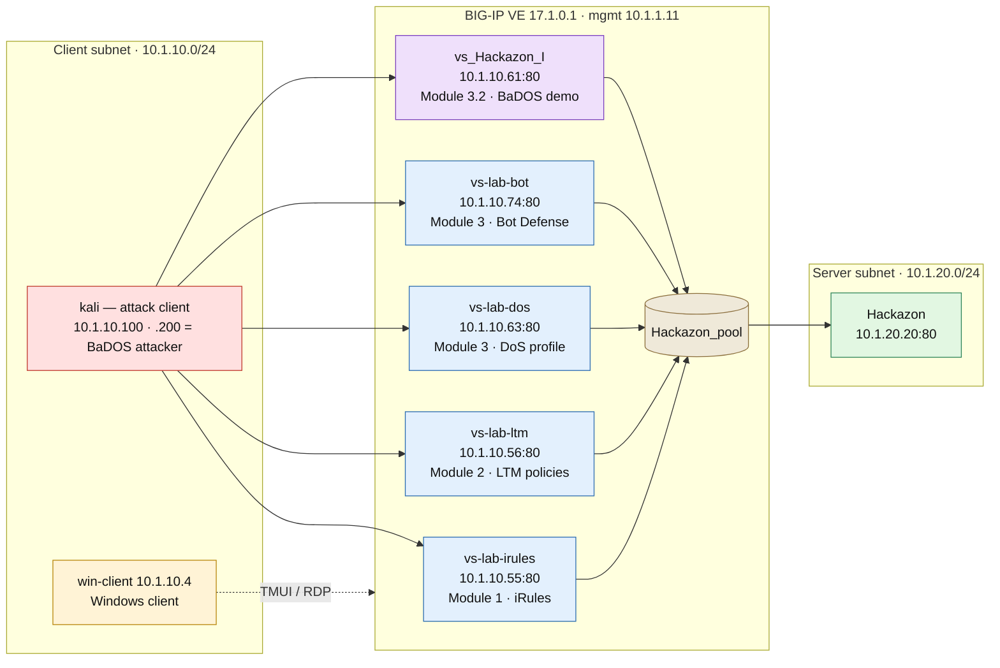

# BIG-IP L7 DoS Lab

A lab environment for testing, demonstrating, and analyzing BIG-IP Layer 7 Denial of Service (L7DoS) protection features.

## Lab Overview

This lab covers three BIG-IP L7DoS mitigation methods across ten scenarios:

- **iRule-based rate limiting** — per-IP, per-URI, concurrent connection, sliding window, and a custom header-absence L7DoS signature
- **LTM Policy path-based rate limiting** — declarative path matching with rate filters, iRule triggers, and datagroup-driven dynamic config
- **ASM / Advanced WAF DoS protection** — TPS thresholds, Behavioral DoS (BADoS), Proactive Bot Defense, stress-based detection, and custom persistent DoS signatures

## Topology

Each protection method runs on its own virtual server, all fronting the same Hackazon backend. See [`docs/setup/lab-topology.rst`](docs/setup/lab-topology.rst) for the build commands.


```mermaid
flowchart LR
    subgraph cl["Client subnet · 10.1.10.0/24"]
        kali["kali — attack client<br/>10.1.10.100 · .200 = BaDOS attacker"]:::attacker
        win["win-client 10.1.10.4<br/>Windows client"]:::client
    end

    subgraph bigip["BIG-IP VE 17.1.0.1 · mgmt 10.1.1.11"]
        direction TB
        v1["vs-lab-irules<br/>10.1.10.55:80<br/>Module 1 · iRules"]:::vip
        v2["vs-lab-ltm<br/>10.1.10.56:80<br/>Module 2 · LTM policies"]:::vip
        v3["vs-lab-dos<br/>10.1.10.63:80<br/>Module 3 · DoS profile"]:::vip
        v4["vs-lab-bot<br/>10.1.10.74:80<br/>Module 3 · Bot Defense"]:::vip
        v5["vs_Hackazon_I<br/>10.1.10.61:80<br/>Module 3.2 · BaDOS demo"]:::demo
        pool[("Hackazon_pool")]:::pool
    end

    subgraph sv["Server subnet · 10.1.20.0/24"]
        hack["Hackazon<br/>10.1.20.20:80"]:::backend
    end

    kali --> v1 & v2 & v3 & v4 & v5
    v1 & v2 & v3 & v4 & v5 --> pool
    pool --> hack
    win -. "TMUI / RDP" .-> bigip

    classDef attacker fill:#ffe0e0,stroke:#c0392b,color:#111
    classDef client fill:#fff3d6,stroke:#b8860b,color:#111
    classDef vip fill:#e3f0fd,stroke:#2b6cb0,color:#111
    classDef demo fill:#efe0fb,stroke:#7b3fbf,color:#111
    classDef pool fill:#efe9d9,stroke:#8a6d3b,color:#111
    classDef backend fill:#e2f7e2,stroke:#2f855a,color:#111
```

## Directory Structure

```
BIG-IP-L7DoS-Lab/
├── configs/          # BIG-IP AS3 / TMSH config snippets
│   ├── profiles/     # DoS protection profiles
│   ├── policies/     # Local Traffic Policies
│   └── irules/       # Supporting iRules
├── scripts/          # Lab automation and traffic generation
│   ├── attack/       # Simulated attack scripts (authorized lab use only)
│   └── setup/        # Lab environment provisioning
├── docs/             # Lab guides and architecture notes
└── tests/            # Validation and verification scripts
```

## Prerequisites

- BIG-IP 14.1+ (lab blueprint uses 17.1.0.1)
- ASM / Advanced WAF license for DoS profiles
- Lab network access configured per `docs/network-topology.md`

## Quick Start

1. Review `docs/lab-setup.md` for environment prerequisites
2. Deploy base config: `configs/profiles/`
3. Run a baseline traffic test: `scripts/setup/baseline-traffic.sh`
4. Trigger a simulated L7DoS event: `scripts/attack/` (lab environment only)
5. Observe mitigation in BIG-IP Analytics / TMUI

## Lab Scenarios

Participants complete every lab through the **BIG-IP UI (TMUI) or CLI (tmsh)** — no AS3 needed. The AS3 JSON declarations under `configs/` are an optional shortcut for instructors to pre-stage a module (see *Deploying with AS3* in `docs/setup/lab-topology.rst`). Click a scenario to open its lab guide.

### Module 1 — iRules
| Scenario | Lab guide |
|----------|-----------|
| 1.1 | [Per-IP rate limiting](docs/module1-irules/lab1/lab1-per-ip-rate-limiting.rst) |
| 1.2 | [Per-URI rate limiting](docs/module1-irules/lab2/lab2-per-uri-rate-limiting.rst) |
| 1.3 | [Concurrent connection limit](docs/module1-irules/lab3/lab3-concurrent-connections.rst) |
| 1.4 | [Sliding window 429](docs/module1-irules/lab4/lab4-sliding-window.rst) |
| 1.5 | [Custom L7 DoS signature (header-absence rate limit)](docs/module1-irules/lab5/lab5-custom-signature.rst) |

### Module 2 — LTM Policies
| Scenario | Lab guide |
|----------|-----------|
| 2.1 | [Path-based rate filter](docs/module2-ltm-policies/lab1/lab1-rate-filter.rst) |
| 2.2 | [Policy + iRule event trigger](docs/module2-ltm-policies/lab2/lab2-policy-irule.rst) |
| 2.3 | [Policy + datagroup (dynamic)](docs/module2-ltm-policies/lab3/lab3-datagroup.rst) |
| 2.4 | [Reject known-bad paths](docs/module2-ltm-policies/lab4/lab4-reject-bad-paths.rst) |

### Module 3 — ASM / Advanced WAF
| Scenario | Lab guide |
|----------|-----------|
| 3.1 | [TPS-based DoS profile](docs/module3-asm-waf/lab1/lab1-tps-based.rst) |
| 3.2 | [Stress-based detection](docs/module3-asm-waf/lab2/lab2-stress-based.rst) |
| 3.3 | [Behavioral DoS (BADoS) + bad-actor detection](docs/module3-asm-waf/lab3/lab3-behavioral-dos.rst) |
| 3.4 | [Custom persistent DoS signatures](docs/module3-asm-waf/lab4/lab4-persistent-signatures.rst) |
| 3.5 | [Proactive Bot Defense](docs/module3-asm-waf/lab5/lab5-bot-defense.rst) |

## Important Notice

Attack simulation scripts in `scripts/attack/` are for **authorized lab environments only**. Do not run against production systems or systems you do not own and have explicit permission to test.
